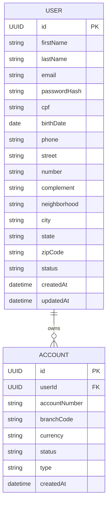

```mermaid
erDiagram
    USER {
        UUID id PK
        string firstName
        string lastName
        string email
        string passwordHash
        string cpf
        date birthDate
        string phone
        string street
        string number
        string complement
        string neighborhood
        string city
        string state
        string zipCode
        string status
        datetime createdAt
        datetime updatedAt
    }

    ACCOUNT {
        UUID id PK
        UUID userId FK
        string accountNumber
        string branchCode
        string currency
        string status
        string type
        datetime createdAt
    }

    USER ||--o{ ACCOUNT : "owns"
```
