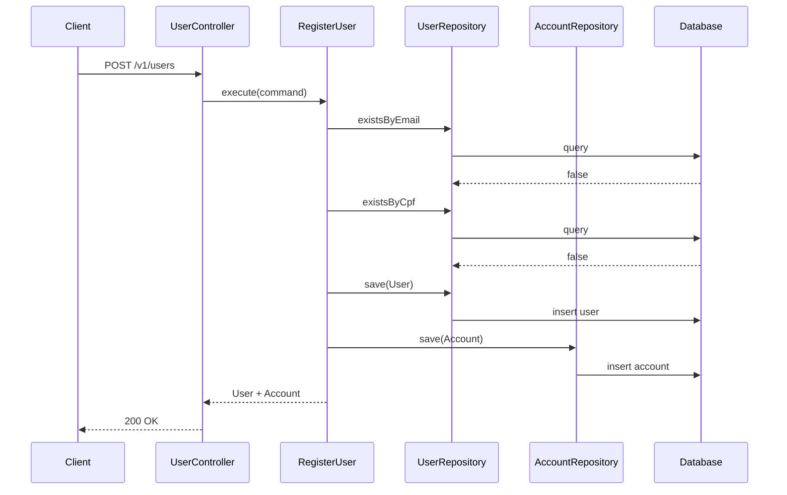

```mermaid
sequenceDiagram
    participant C as Client
    participant API as UserController
    participant UC as RegisterUser
    participant UR as UserRepository
    participant AR as AccountRepository
    participant DB as Database

    C->>API: POST /v1/users
    API->>UC: execute(command)

    UC->>UR: existsByEmail
    UR->>DB: query
    DB-->>UR: false

    UC->>UR: existsByCpf
    UR->>DB: query
    DB-->>UR: false

    UC->>UR: save(User)
    UR->>DB: insert user

    UC->>AR: save(Account)
    AR->>DB: insert account

    UC-->>API: User + Account
    API-->>C: 200 OK

```
